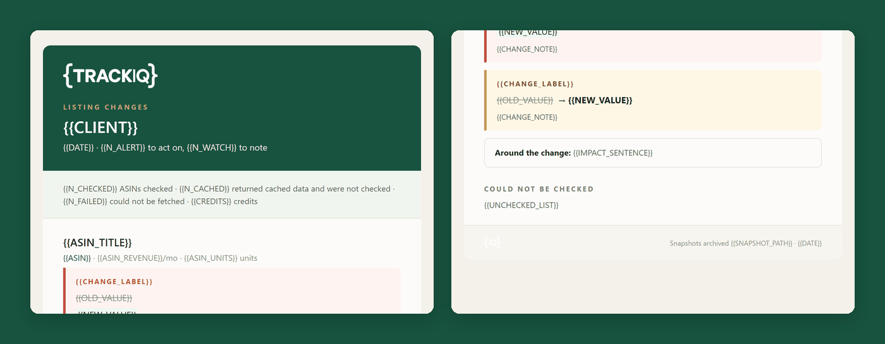

# TrackIQ: Amazon Listing Monitor

Watches a brand's listings every day and alerts **only when something actually
moved**.

Silence is the normal output. If the email arrives, something real happened.

Built as an [Agent Skill](https://code.claude.com/docs/en/skills). Runs in
Claude Code, Claude web, Claude desktop and ChatGPT from the same folder.

---

## ⚠ This skill needs a scraper and somewhere to store snapshots

| What | Why | Cost |
|---|---|---|
| **Oxylabs scraper** | `get_product` for listing state | **1 credit per watched ASIN, per run** |
| **Snapshot storage** | It's a diff — without yesterday's file there's nothing to compare to | a filesystem |
| **TrackIQ MCP** | `get_product_performance` and `get_bsr` — the watchlist and the revenue behind each ASIN | included |

**There's no fallback.** Listing state has to be observed from the public
page — first-party data will not show you a rewritten title. With no storage
the skill can take a baseline and nothing more, and it says so rather than
pretending to monitor.

A 50-ASIN watchlist is 50 credits a day.

---

## Powered by the TrackIQ MCP

The revenue weighting comes from your live Amazon account through the
**[TrackIQ MCP](https://trackiq.com/mcp)** — 16 tools connecting your AI
assistant to Amazon data. **[Get access →](https://trackiq.com/mcp)**

---

## What you get



*The alert email: what changed, on which ASIN, with the revenue behind it —
and an explicit list of what could not be checked.*

It snapshots each watched ASIN, compares against the last good snapshot, and
reports only the changes that matter:

- a **rewritten title or bullet**
- a **lost image**
- a **missing A+ description**
- a **category move**
- a **new seller in the buy box**
- **price or rating** past a threshold
- any listing that has **stopped being purchasable**

Each finding carries the revenue behind that ASIN, so the biggest one sorts to
the top.

### Two things make it more than a diff

**It's tuned for quiet.** Delivery dates, review counts and BSR move on their
own every single day, so they are never diffed. A monitor that cries wolf daily
gets filtered into a folder nobody opens — the whole design goal is that an
arriving email means something.

**It keeps a dated snapshot archive.** That's the evidence that opens a Seller
Support case: proof the listing said something different on Tuesday. The alert
footer records where the archive lives.

### It tells you what it couldn't see

Every alert states how many ASINs were checked, how many returned cached data
and were skipped, how many failed, and what the run cost in credits. A listing
that couldn't be fetched is listed as **not checked** — never reported as
unchanged, and never as suppressed.

---

## Install

### Claude Code

```
/plugin marketplace add TrackIQ-HQ/amazon-seller-skills
/plugin install trackiq-amazon-listing-monitor@trackiq
```

### Claude web, desktop, mobile

1. Download the `.zip` from the
   [latest release](https://github.com/TrackIQ-HQ/trackiq-amazon-listing-monitor/releases)
2. **Settings → Capabilities → Skills** (code execution must be on)
3. **Create skill → Upload a skill**, choose the `.zip`
4. Toggle it on

### ChatGPT

Same zip. **Plugins → Skills → Create → Upload from your computer.**

---

## Setup

Answers live in `account.md`, copied from
[`assets/account.example.md`](skills/trackiq-amazon-listing-monitor/assets/account.example.md).
**Every TrackIQ skill reads the same file.**

You also set a **snapshot location** — where the dated archive lives between
runs.

**The first run takes a baseline and alerts on nothing.** That's correct
behaviour, not a quiet day, and the skill says which it was.

## Delivery

Asked once and stored in `account.md`: **in-chat** (default), **file**,
**Slack**, **n8n** or **email**. It only sends when something moved.

## When to run it

Daily, on a schedule. The value is in the cadence — a monitor run occasionally
is just a diff against an arbitrary past date.

---

## Customizing

| To change | Edit |
|---|---|
| Watchlist, thresholds, snapshot location, delivery | `account.md` — no skill edits |
| Which fields are diffed and which are ignored | `assets/fields.md` |
| The call sequence and the credit model | `assets/pulls.md` |
| The diff logic | `assets/differ.py` |
| The pre-send checks | `assets/checks.md` |
| The alert email | `assets/alert-template.html` |

Two rules are load-bearing.

**Never diff a field that moves on its own.** Delivery dates, review counts and
BSR change daily without anyone touching the listing. Diffing them is how a
monitor becomes noise.

**A failed fetch is not a change.** An empty or errored response means *not
checked* — reporting it as a suppression or a stripped listing manufactures an
emergency out of a network blip.

`assets/differ.py --selfcheck` runs the built-in test and must report all
checks passing.

---

## Contributing

```bash
python scripts/validate.py    # must exit 0 before any commit
python scripts/build.py       # writes dist/ zip + registry.json
```

Read [AUTHORING.md](https://github.com/TrackIQ-HQ/amazon-seller-skills/blob/main/AUTHORING.md)
before proposing changes.

## License

MIT. See [LICENSE](LICENSE).
